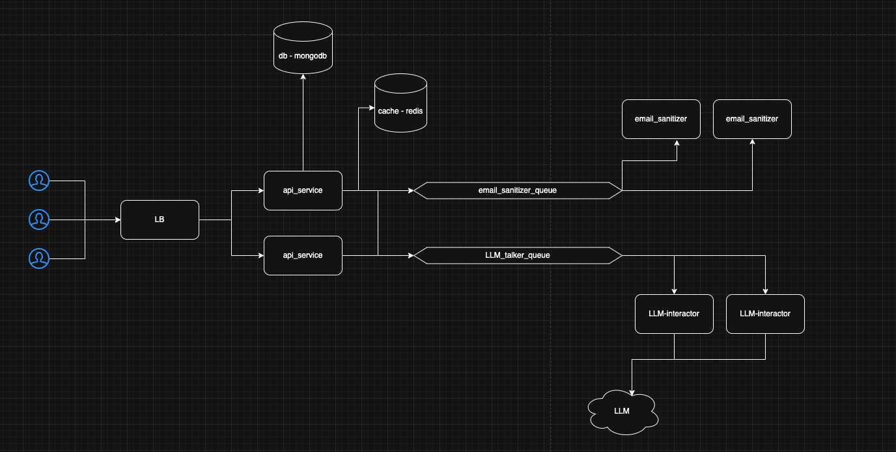

## Overview
This service sanitizes user prompts and LLM responses by masking personal email addresses. The system is designed to handle high-scale operations with multiple clients and users.

## Performance Assumptions
My made up numbers assumptions
  - 10,000 companies
  - 100 users per company
  - 100 prompts per user daily
    - Total daily requests: 100,000,000
    - Requests per second: ~1,000
  - Average request size: ~305KB (10,000 words × 5 chars)

## How to run
Firstly:
```
docker compose up --build
```
After the containers are all up & running (in a different terminal instance):
```
docker exec -it llm ollama pull tinydolphin
```

**Testing Script (makes random prompts with emails inside of them):**
```
./test_script.sh <AMOUNT_OF_DUMMY_PROMPTS> <AMOUNT_IN_PARALLEL>
```
# Example:
```
./test_script.sh 30 10
```
Please be advised that this script wont use result is "cache hits" because the data is randomly generated.

Then checkout the `response.json` file which has results.

## Architecture


## Technical Design

**Services:**
- `api-service`: Client interaction and worker orchestration
- `email-sanitizer-service`: Text sanitization
- `llm-interactor-service`: LLM communication

**Technology Stack:**
- Load Balancer: Nginx
- Framework: NestJS (TypeScript)
- Cache: Redis
- Database: MongoDB
- Queue: Redis Queue
- LLM: Ollama TinyDolphin
- Authentication: JWT with Bearer tokens
- Docker: for packging

**Amount of Service:**
I choose 2 of the `api-service`, `email-sanitizer-service` & `llm-interactor-service` just for the sake of showing multiple services handling the workloads (nothing specical about the number 2).
 
**Packing:**
Used docker for so it would be easy & convinient to run on any machine.

**Cache Implementation:**
- 100,000 entry limit
- Popularity-based scoring algorithm

**DB Decision:**
- MongoDB integration for request logging, analyzing & such (this wasn't asked for, but it made sense to have it + it helped me in the developer process) 

## Limitations and Future Improvements
- Authentication could be migrated to third-party services (e.g., Auth0)
- Production scaling would require tools which "scale better":
  - Kafka for queuing
  - AWS Load Balancer

## Disclaimers
- I used ChatGPT here and there
- I didn't drill down to everything which i used because of time limitations (We said 4 hours +-)
